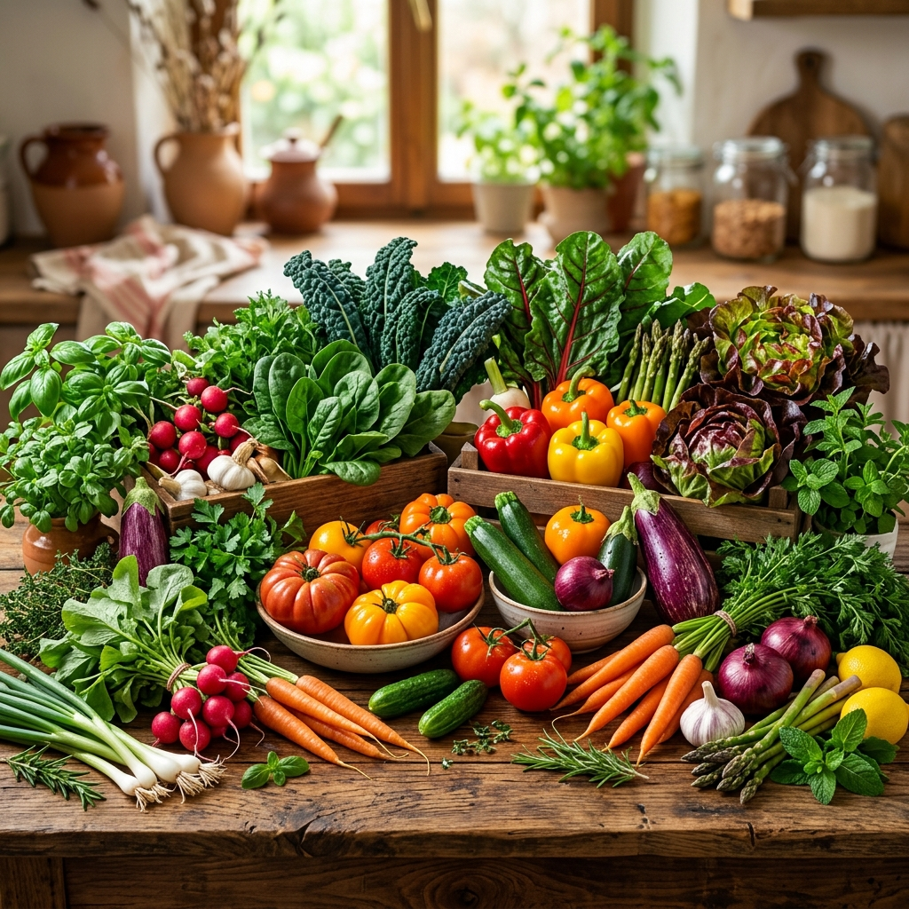

# 🌿 NutriHerb

Welcome to **NutriHerb**, a fully-featured Django web application designed to connect everyday people with functional nutrition, herbal wisdom, and wholesome recipes. Say goodbye to generic health advice and hello to personalized dietary suggestions paired with a stunning, nature-inspired user interface.



## 💡 About The Project

NutriHerb was built with a clear goal in mind: translating deep nutritional data into an accessible, beautiful, and highly responsive user interface without compromising on performance. 

### Why is this special?
- **Premium UI Overhaul**: Features a modern, light-theme glassmorphism design. Think flowing, animated ambient gradients (like sunlight on leaves), sleek frosted-glass cards, bouncing hover/scale interactions, and the gorgeous *Outfit* Google font.
- **RESTful API Native**: Built using Django REST Framework (`djangorestframework`). Data is natively served via viewsets to ensure everything runs rapidly and synchronously on the frontend via JavaScript.
- **Dynamic Content Flow**: Searching dynamically updates without page reloads using a lightweight Vanilla JS frontend caching solution.
- **Bento Grid Architecture**: A fully responsive, modern masonry-style bento-box grid highlights features in an engaging, unconventional layout format.

## 🚀 Features

- 🥑 **Nutrient Database**: Explore detailed breakdowns of superfoods, greens, and holistic herbs.
- 🥘 **Dynamic Recipes**: Easily find practical, minimal-ingredient recipes specifically curated to integrate these superfoods into your daily routine.
- 🩺 **Health Goals Hub**: Connect your specific health needs (e.g. Immunity, Digestion, Iron levels) safely and effectively with foods that have been clinically tested to assist them.

## 🛠️ Built With

- **Backend framework:** Django & Python
- **API framework:** Django REST Framework
- **Frontend structure:** Django Templates + HTML5
- **Styling:** Custom Vanilla CSS with absolute responsive perfection.
- **Database:** SQLite (Demo content loaded and ready-to-run out of the box)

## 🏁 Getting Started

To get a local development copy up and running, follow these simple steps:

### Prerequisites

You need Python 3.9+ installed natively to run this application.

### Installation

1. **Clone the repo**
   ```sh
   git clone https://github.com/your-username/nutriherb.git
   cd nutriherb
   ```
2. **Create a Python Virtual Environment**
   ```sh
   python -m venv .venv
   source .venv/bin/activate  # On Windows use: .venv\Scripts\activate
   ```
3. **Install the Requirements**
   ```sh
   pip install -r requirements.txt
   ```
4. **Boot it up! (Database comes pre-populated with realistic demo content)**
   ```sh
   cd nutriherb
   python manage.py runserver
   ```
5. **Visit the app**
   Navigate to `http://127.0.0.1:8000/` in your browser.

## 📁 Repository Structure
- `nutriherb/` (Project Root)
  - `nutrition/` (Core App including Models, Views, API ViewSets, Serializers)
  - `templates/` (Premium Glassmorphic Templates: home, recipes, foods, health)
  - `static/` (CSS styles, Fonts, SVG/PNG High-Res Graphics, Scripts)
  - `populate.py` (Script used to inject the initial amazing content)
- `.gitignore` (Polished file exclusions for Github)
- `requirements.txt` (All pinned python packages)

## 👤 Author
Designed and developed carefully for a modern web standard. Feel free to fork, enjoy, and eat healthier!
